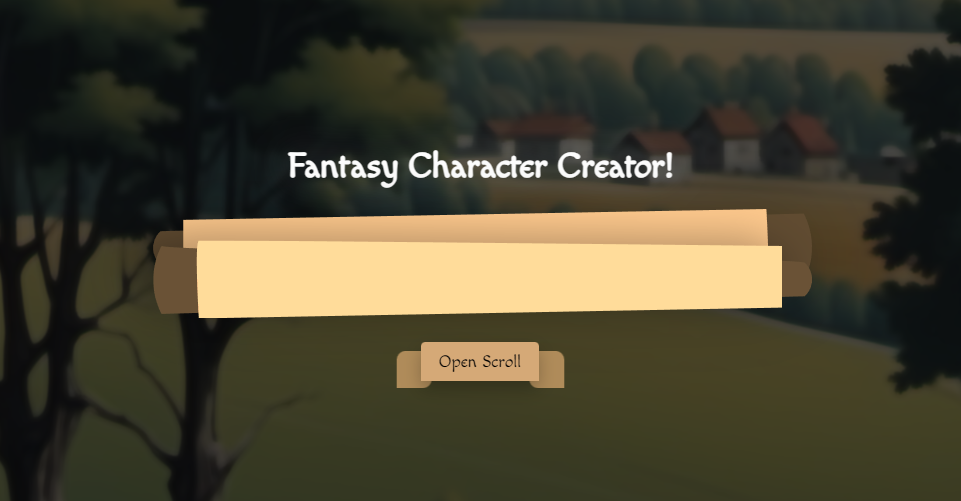

**How To Run**
- Run: npm install
- Run: node server.js
- Go to [http://localhost:5500/](http://localhost:5500/) (can be changed in server.js to a different port, and shouldn't break anything if you do.)

***<u>Assignment Requirements</u>***

- *15 requirements completed and working:* All 15 requirements I had on my proposal are completed and working.
- *Must have an API Server:* I do, and all four CRUD endpoints are used. They can be found in client-server-communications and server.js
- *Vanilla JS on the Frontend:* Vanilla JS throughout.
- *Well designed:* Honestly I think it's the best thing I've ever designed!
- *At least 5 commits per week:* I didn't do too well on this one. I forgot to make commits when I really started about two weeks ago, and I scrapped it all and restarted last week so it didn't even matter.
 
____

___Where Content (not created by me) was found___

**Images**

- [Images](https://www.reddit.com/r/rpg/comments/gpghyq/500_fantasy_character_portrait_icons/) : Free to use for what ever I want, AI generated
- Background Image : AI generated and edited by me from [here](https://openart.ai).
- The scroll rolling part thingies :  Created by me in illustrator.

**Where I learned how to get a list of everything in a folder:**

- [Get List of All Files In a Directory In Node JS](https://medium.com/stackfame/get-list-of-all-files-in-a-directory-in-node-js-befd31677ec5#:~:text=js%20fs%20core%20module%20to,all%20files%20in%20the%20directory.) : I used it to get all the media images.

**Scroll Wheel Editing**

- [Styling Webkit Scrollbar](https://stackoverflow.com/questions/44212713/styling-webkit-scrollbar-track-not-working)

**Fixing some z-indexing Issues**

- [Stack Overflow](https://stackoverflow.com/questions/3032856/is-it-possible-to-set-the-stacking-order-of-pseudo-elements-below-their-parent-e)

**Wiggle Animation**

- [Stack Overflow](https://stackoverflow.com/questions/38132700/css-wiggle-shake-effect) : This one made me feel dumb because it's so simple yet I spent so long before looking for this solution :/

**Figuring out how to smooth animate the scroll as it collapses/opens**

- [The simple trick to transition from height 0 to auto with CSS](https://www.youtube.com/watch?v=B_n4YONte5A&t=155s) : The trick is to not use height at all.